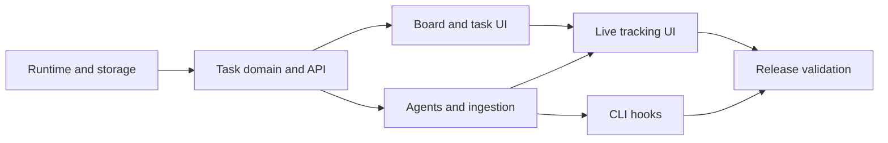

# Implement AgentFlow v0.1

This plan builds the local application described in [ROADMAP.md](ROADMAP.md). This PR delivers documentation only. All implementation boxes remain unchecked. P01-P07 are proposed work-package identifiers, not existing GitHub PR numbers.

## Use the plan

Implement one work package per reviewable PR. Record its commit, commands, actual results, and limitations before marking it complete. Keep small Conventional Commits with one behavior per commit. Add focused failing behavioral tests before implementation when a contract warrants them, then keep later commits green.

Use the accepted [architecture](docs/ARCHITECTURE.md) and [API contract](docs/API.md). Changes to task acceptance, local trust, event order, or the observer boundary require an updated [decision record](docs/DECISIONS.md).

The operator approved the [v0.1 execution policy](docs/EXECUTION_POLICY.md) on 2026-10-09. Read it before implementation: it authorizes package integration after passing checks and independent review, replaces operator browser sign-off with verified evidence, and defines release authority and stopping conditions. Execution can use Poteto's Feature playbook for each package and Opening a PR for delivery, alongside other relevant available skills. Saving this approval does not start implementation, create a goal, schedule recurring work, or authorize agent execution from AgentFlow.

## Dependencies and ownership

P03 and P04 can run independently after P02. P05 and P06 can run independently after their prerequisites. Give concurrent writers disjoint files or isolated worktrees. Assign shared contract and migration changes to one owner. Never let parallel agents edit the same SQLite file, branch, or test data directory.

The critical path is runtime proof, domain/API, ingestion and board, live tracking, then release validation. More parallel workers cannot shorten that dependency chain. Use one independent reviewer for the integrated result. Test and review against the exact proposed PR commit.

## P01. Prove the local runtime and storage

Depends on no earlier package. Proposed files include `package.json`, lockfile, Node version pin, Next.js configuration, `src/db/`, local launcher/auth modules, and initial integration tests.

- [ ] Select exact supported versions. Record Node and better-sqlite3 compatibility using the isolated macOS installation procedure in the execution policy.
- [ ] Scaffold Next.js, TypeScript, Tailwind, lint, type checking, Vitest, and Playwright. Define the commands used below.
- [ ] Prove SQLite transactions and a streamed response in `npm run build && npm start` before selecting the driver permanently.
- [ ] Implement data-directory permissions, loopback binding, exact Host/Origin checks, separate pairing/reporter credentials, protected page/API reads, and session revocation. Prove a reporter token cannot create a session or call human-only commands.
- [ ] Implement the single-instance lock, migrations, integrity-checked backup, and stopped-service restore with generation renewal.
- [ ] Disable framework telemetry and remove external font/asset dependencies.

Pass when a clean production launch binds only to loopback, an unauthenticated private read fails, and authenticated reads work. A second instance must fail safely. Restart, a failed migration, and restore must preserve the documented data state. Capture listener output, HTTP responses, and the integrity check.

Run the runtime integration suite, lint, type checking, and production build. Measure baseline idle memory and startup time on the named machine. These are initial measurements, not pre-existing performance promises.

## P02. Build project and task contracts

Depends on P01. Proposed files include shared schemas, Drizzle tables/migrations, task domain rules, query/command modules, `/api/v1` task/project/session routes, and generated OpenAPI.

- [ ] Define the entities and allowed transitions in [BACKEND.md](docs/BACKEND.md).
- [ ] Implement project/task CRUD within the documented archive and no-hard-delete limits, comments, completion, and reopen.
- [ ] Store idempotency receipts, optimistic versions, work revisions, and durable change records transactionally.
- [ ] Define snapshot reads, pagination, totals, and Overview metrics with timezone boundaries.
- [ ] Generate OpenAPI from schemas and validate every published request/response example against them.

Pass when HTTP create/edit/move/reopen calls persist across restart, retries return the original result, and stale writes cannot overwrite newer data. Completion must require human session evidence. A forged harness completion must fail. Test parent cycles, cross-project references, archived projects, and daylight-saving boundaries.

Run unit and real-database integration suites. Compare task-list query latency at base and head with the same fixture where available. For newly introduced endpoints, measure against the absolute P07 budget and state that the base has no equivalent operation.

## P03. Deliver the manual board journey

Depends on P02. Proposed files include page layouts, project/board/task components, query-cache integration, and browser tests. Agent run controls are not part of this package.

- [ ] Build Overview, project list, board, task panel, and settings/pairing UI.
- [ ] Implement create/edit, status-menu movement, comments, completion evidence, and reopen before adding drag interaction.
- [ ] Add dnd-kit for cross-column movement through the same command. Do not add manual sorting.
- [ ] Implement filters, load-more controls, empty/loading/error states, and version-conflict recovery.
- [ ] Verify keyboard navigation, focus restoration, reduced motion, contrast, zoom, and a 375 px layout.

Pass when automated real-browser tests complete the full manual journey and its records survive restart. Synthetic acceptance fixtures exercise the human-only browser command without claiming an actual human attestation. Two tabs editing the same task must expose a conflict rather than lose an edit. Dropping into Completed must open acceptance, not bypass it.

Run the focused browser suite plus lint, type checking, and build. Attach board, task-panel, conflict, and narrow-layout screenshots and a short journey recording to the PR. Record board-load timing using the P07 fixture. Obtain independent review of the interaction evidence and exact candidate commit before merge under the execution policy.

## P04. Accept reliable agent observations

Depends on P02. Proposed files include agent/run schemas, run state rules, event ingestion, migrations, HTTP handlers, and integration fixtures.

- [ ] Implement agent registration and per-attempt runs, including active-run uniqueness and task version checks.
- [ ] Implement the event envelope, strict sequence policy, exact-duplicate recovery, and terminal-state protection.
- [ ] Commit events, run/task projections, receipts, and change records together.
- [ ] Implement heartbeat freshness and the browser-only close-stale-record action.
- [ ] Update OpenAPI and add a deterministic producer fixture that emits real HTTP requests.

Pass when implementation success moves a task only to Review and does not claim task acceptance. Replay duplicates, conflicting IDs, missing/reordered sequences, unknown references, and terminal regressions. Kill the server before commit and after commit but before the response; retry and inspect actual persisted state. Check two concurrent attempts for the same task yield one accepted owner.

Run domain and HTTP/SQLite integration tests. Capture producer requests, responses, and database counts. Compare ingestion under the same fixture when a base exists; otherwise record new-endpoint latency and the absolute P07 budget. These tests exercise the application's public API, not mocked database methods.

## P05. Show live agent tracking

Depends on P03 and P04. Proposed files include the SSE route, snapshot queries, client subscription, Agents/Activity views, and browser integration tests.

- [ ] Implement authenticated replay from durable changes without retaining database read transactions.
- [ ] Add generation/reset handling, connection limits, slow-consumer disconnect, and abort cleanup.
- [ ] Show agent/run history, reported freshness, failure attention, and task-linked events.
- [ ] Add visible connection state, polling fallback, and full snapshot recovery.
- [ ] Verify that no displayed agent status claims unobserved process liveness.

Pass when two tabs converge after a report and neither misses a write between snapshot and subscription. Disconnect, restart, restore, reconnect, duplicate delivery, expired session, and a slow consumer must follow the documented behavior. Retrying a pre-restore receipt must expose the current generation and trigger a snapshot refresh. Verify fallback polling stops when subscriptions recover and resources release when tabs close. The connected-state 15-second freshness refresh remains active while visible. Prove that silence alone marks a run stale within 75 seconds and updates Overview without another write or navigation. Test a local-day rollover and a lost command response whose retry arrives after a newer task version has loaded.

Run browser and real-server integration tests against a production build. Record report-to-visible latency, bounded stream memory, and a reconnect video. Include stale-agent and disconnected-browser screenshots as separate states.

## P06. Connect a harness through CLI hooks

Depends on P04. Proposed files include `src/cli/`, outbox modules, CLI integration tests, and an integration walkthrough.

- [ ] Implement registration commands and reports using public HTTP contracts.
- [ ] Allocate IDs and per-run sequences under a lock, then preserve reports before delivery.
- [ ] Implement bounded outbox storage, flush, retry/backoff, exit codes, and actionable non-retryable errors.
- [ ] Document token access without URL/query secrets or shell-history examples containing real credentials.
- [ ] Provide an executable external producer walkthrough demonstrating one implementation attempt and a separate review or verification attempt on the same task, including heartbeats, retry, and flush.

Pass when a real CLI report appears in the API and SQLite, including after server downtime and a CLI restart. Replay the same queued item after a lost response and observe no duplicate. Test concurrent report calls, permissions, full disk/outbox, authentication failure, missing sequence data, and restored-database limitations.

Run the CLI through subprocess integration tests and an interactive terminal walkthrough. Preserve actual exit codes. Measure flush throughput under the P07 fixture. The CLI must not require an installed provider-specific agent or access to private Codex/Claude storage.

## P07. Verify and release v0.1

Depends on P05 and P06. Proposed files include release walkthroughs, load scenarios, backup/recovery documentation, and focused fixes supported by failing evidence.

- [ ] On a fresh data directory, create a project/task/agent, register an implementation run, report start/progress/success, inspect Review, record acceptance, and reopen.
- [ ] Repeat with failure, staleness, duplicate reporting, downtime, and reconnect. Verify both browser tabs and persistent history.
- [ ] Check unauthenticated reads/SSE, cross-origin mutation, spoofed Host, oversized payloads, invalid links, and non-loopback access.
- [ ] Verify migration failure recovery, backup restoration, generation reset, permissions, and the documented outbox recovery limits.
- [ ] Run the load scenario below and inspect resource cleanup.
- [ ] Run the execution policy's isolated-install walkthrough, keyboard journey, production build, full relevant tests, lint, and type checking.
- [ ] Verify the approved MIT license and notices, set package license metadata, and record the tested macOS configuration and exact dependency versions.
- [ ] Obtain independent review at the release commit, including browser journey evidence, then integrate and publish the v0.1.0 source release under the execution policy.

## Performance acceptance targets

These are proposed budgets, not measured results. Adjust only through a recorded decision with measurements and user impact.

Use a named machine, production build, 1,000 tasks, 10,000 stored run events, 10 producers on distinct tasks, and two browser tabs. Run 20 new events/second for five minutes, then a 100-event/second burst for ten seconds. Respect configured rate limits and record any expected `429` responses separately from accepted events. Producers emit valid ordered lifecycles.

- [ ] Accepted-event HTTP latency is below 250 ms at p95 under sustained load.
- [ ] Report-to-visible latency is below two seconds at p95 while connected.
- [ ] Board snapshot latency is below 250 ms at p95 for the stated fixture and bounded page size.
- [ ] A disconnected producer flushes 1,000 queued reports without loss or duplication within two minutes on loopback.
- [ ] After 100 connect/disconnect cycles, open-stream count returns to baseline and heap use returns within 20% after the same controlled collection procedure.

Collect at least three interleaved base/head runs for changed operations and retain raw samples. A greater than 20% p95 regression requires explanation and approval even if an absolute budget passes. Where base lacks a feature, report that fact and use its absolute budget; do not invent a relative speedup. The load targets do not promise support for arbitrary transcript volume.

## Evidence and completion

Unit tests cover transitions and validation. Integration tests cover the actual HTTP/database/CLI boundaries. Browser tests cover visible state and input. Screenshots prove appearance, not persistence. Performance samples prove only the stated workload and machine.

For each PR, record the head SHA, test commands/results, scenario logs, screenshots where UI changes, source of synthetic data, and known limitations. Store runtime evidence outside the tracked data directory and upload only synthetic, redacted artifacts. Keep provider credentials, real repository paths, prompts, and private task text out of public PRs.

Completion of this plan requires all P01-P07 gates to pass. The current documentation PR does not claim any of them has run.
