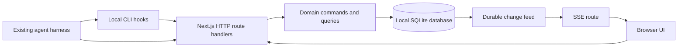

# AgentFlow architecture

Status: accepted v1 design direction. P01–P05 are integrated through PRs #4–#8,
including native replay, joined tracking and browser recovery. P06 producer CLI hooks are implemented on the candidate branch; workflow
modules remain planned. The user selected this direction on 2026-10-09. Detailed
decisions are in [DECISIONS.md](DECISIONS.md).

## System boundary

AgentFlow serves one operator on one machine. Each project has one board and optional repository metadata. An external harness owns agent execution, credentials, scheduling, worktrees, and subprocesses. AgentFlow stores tasks and accepts observations.



All boxes except the existing harness are part of the local application. No queue server, cloud service, or separate backend deployment is required.

## Selected stack

| Area | Choice | Reason |
| --- | --- | --- |
| Application | Next.js App Router, React, TypeScript | One application for browser pages and HTTP routes |
| Styling | Tailwind CSS and selected shadcn/ui components | Shared accessible controls with an original visual design |
| Board | dnd-kit | Drag interaction layered over an accessible status menu |
| Database | SQLite, Drizzle ORM, better-sqlite3 | Local relational data, explicit migrations, short transactions |
| Events | HTTP JSON ingestion and Server-Sent Events | Harness reports changes; browser receives notifications |
| Validation | Zod contracts shared by server and CLI | Parse external input once at the boundary |
| Verification | Vitest, Playwright, real temporary SQLite files | Domain behavior, HTTP integration, and browser journeys |
| Workflow graph (W01) | React Flow | Interactive view of reported workflow dependencies |

Next.js Route Handlers support HTTP handlers and streaming responses. The self-hosting guide describes operation as a Node server. This supports the proposed single-application boundary, subject to the production-build spike in P01. [Route Handlers](https://nextjs.org/docs/app/api-reference/file-conventions/route), [self-hosting](https://nextjs.org/docs/app/guides/self-hosting).

Drizzle documents SQLite drivers including better-sqlite3. P01 verifies better-sqlite3 13.0.3 installation and production loading on Node
24.15.0, independently reviewed and integrated in PR #4. See [the receipt](implementation/P01.md). [Drizzle SQLite](https://orm.drizzle.team/docs/sqlite/get-started-sqlite).

Pin exact package versions and the Node runtime in P01. Do not copy old dnd-kit examples without checking the selected release's API. Its current documentation separates the current toolkit from legacy examples. [dnd-kit](https://dndkit.com/).

## Application boundaries

Route handlers authenticate, validate requests, call domain commands, and map results to HTTP. Domain modules own task acceptance, run transitions, and event deduplication. Database modules own queries, transactions, and migrations. Components never make lifecycle decisions independently.

Initial server-rendered reads call the same query modules after session validation. Browser mutations and CLI reports use the versioned HTTP API. There is no second mutation path through Server Actions in the first release.

The database is authoritative. Run events and the change feed are audit records beside current tables. This is not a general event-sourcing framework. Schema migrations upgrade stored state directly.

## Proposed source layout

P01 runtime/auth/storage and minimal page/route files exist. Task, reporting and
workflow paths in this target layout remain planned.

```text
src/app/                       Pages, layouts, login, and /api/v1 routes
src/components/                Board, task panel, agent list, shared controls
src/contracts/                 Request, response, and event schemas
src/domain/                    Task and run state rules
src/server/                    Auth, domain commands, queries, event ingestion
src/db/                        Drizzle schema, connection, migrations
src/cli/                       Pairing support and report commands
migrations/                    Reviewed SQL migration files
tests/unit/                    Domain and contract tests
tests/integration/             HTTP, SQLite, event, and recovery tests
tests/e2e/                     Browser journeys
tests/performance/             Repeatable local load scenarios
```

Server-only imports keep filesystem access, credentials, and database code out of browser bundles. Only route handlers for application data use the Node runtime. No edge or serverless deployment is supported.

## Runtime and data ownership

One custom Next HTTP server process owns a data directory. Before migrations, the launcher holds an exclusive SQLite transaction on the stable `instance-lock.sqlite` inode. A different port still competes for the same directory. OS locking is authority; PID metadata cannot reclaim a live lock. Crashes release the OS lock. Shutdown rejects new work, drains tracked handlers, closes Next and application connections, then releases ownership last. Application connections require the live owner and private routes/pages require the same-process runtime guard.

`AGENTFLOW_DATA_DIR` can select an absolute local path. The default is `~/Library/Application Support/AgentFlow` on macOS and `$XDG_DATA_HOME/agentflow` on Linux, falling back to `~/.local/share/agentflow`. The first release targets macOS; Linux support depends on the same clean-install checks. Windows is deferred.

The directory holds `agentflow.sqlite`, its WAL files, and the versioned `credentials.json` token set. The producer outbox uses a separate private directory, defaulting to `~/Library/Application Support/AgentFlow-outbox`. Public `/settings` binds its service association before new mutations, with canonical overlap checks and a pinned offline destination. CLI hooks never open the application Store. Immutable JSON files, durable descriptors/watermarks, and stable SQLite OS-held locks preserve identity and FIFO. Quotas measure owned logical regular-file lengths, including metadata, temps, locks, and sidecars, rather than filesystem allocation overhead. See [CLI.md](CLI.md). Directory permissions are user-only and sensitive files use mode `0600`. Managed data, explicit Store candidates and backup destinations are rejected
inside the canonical active application root before writes. The instance freezes
that CWD root and Next uses it; case aliases are recognized by directory identity,
raw symlinks are rejected before dot normalization, and no global repository scan
or root override is introduced. No data belongs in the public checkout. The application rejects a relative override and documents that network filesystems are unsupported.

P06 global event selection and durable delivery-cursor publication share one
existing publication owner. Network delivery occurs after release. ACK watermark
advancement and cleanup have a separate owner and return completion at that
boundary; later enqueues remain future work. Every acquisition keeps full recovery,
identity/coverage, path/pin/permission, sidecar, logical-length and outstanding-peak
validation. No validation cache survives ownership. The cursor is not an execution
scheduler; the external harness still owns processes. Performance evidence used
cached P05 application assets with the candidate CLI, followed by a separately
recorded fresh production build. See [the P06 receipt](implementation/P06.md).

Normal use works without internet after dependencies are installed. External links open only after a user action. No repository scanning, transcript discovery, remote analytics, or provider credential storage is part of the first release.

## Growth boundaries

Phase 3 adds workflow nodes and dependencies as a reported graph. A graph edge records ordering or evidence; it does not schedule work. React Flow is the v1 Phase 3 display component, not a backend scheduler. [React Flow documentation](https://reactflow.dev/learn).

Agent controls require a separate decision record covering executable allowlists, process isolation, credential handling, cancellation, and authorization. The current API deliberately has no launch, shell, or stop endpoint.

The complete v1 boundary includes Phases 1–3 and W04 release validation.
[V1_WORKFLOWS.md](V1_WORKFLOWS.md) supplies additive workflow, dependency/review,
export/retention, and usage contracts. These remain modules in the same local
application and SQLite database. The sole optional outbound application adapter
is read-only GitHub PR metadata observation for explicitly selected repositories;
it is disabled by default. No workflow graph or dependency module owns processes.

### P05 native stream ownership

The first P05 transport slice registers the browser-only stream capability in
the shared endpoint registry. The native launcher owns SSE delivery and bounded
leases to observe real Node write/drain pressure and avoid framework response
compression. Next's fallback returns unavailable for this capability. Shutdown
closes stream leases and resolves their dispatches before storage drain/closure.
See [the transport receipt](implementation/P05-transport.md); client/UI gates
remain open.
