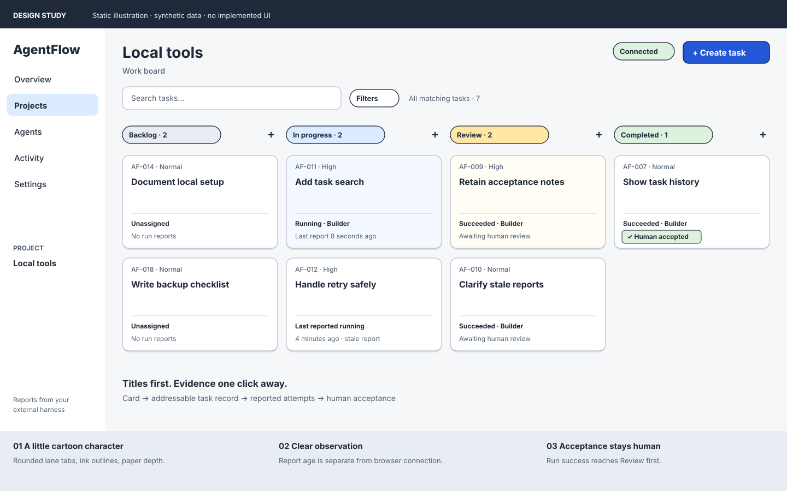
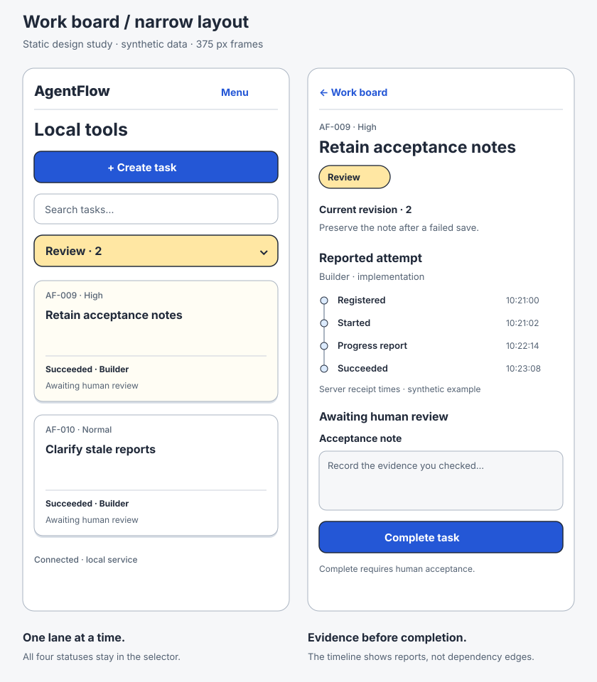

# Work board: design brief

Status: documentation proposal, 2026-10-09. Refines the user-selected Work board
prototype. This PR does not implement UI or activate the v0.1 delivery plan.
Mode: Operate. Audience: an engineer tracking tasks and explicit reports from
agents started in Codex or another external harness.

## Intended result

Keep the familiar four-column board and make it a little more playful. A task
has a bold readable title on a lightly outlined paper card. Rounded colored lane
tabs add personality. The record's meaning stays precise: an implementation can
succeed while its task still awaits human review.

[Fizzy's homepage](https://www.fizzy.do/) and its
[published board screenshot](https://www.fizzy.do/assets/images/board.png), inspected
on 2026-10-09, are visual references. The screenshot shows assertive task titles,
colored status markers, and paper-like cards. Adapt those qualities to AgentFlow's
fixed lanes and evidence trail. Do not copy Fizzy assets, custom-column semantics,
auto-closing behavior, vertical collapsed lanes, or its marketing page treatment.

## Static visual studies

These original SVG drawings are design illustrations, not application screenshots,
interactive prototypes, or implemented components. All names, tasks, counts, and
reports are synthetic. They embed no external resources or scripts.

## Board and evidence hierarchy

1. Compact navigation holds Overview, Projects, Agents, Activity, and Settings.
   The active project is visible; Create task stays beside the project title.
2. Search and filters sit above the lanes. Counts cover all matching tasks,
   including unloaded pages. Lanes initially load 50 records, newest first.
3. Each card leads with title, then priority and assignment. Show latest outcome,
   report age, and a blocker if present. Show a parent-task link where applicable.
   Missing assignment or run information stays explicitly absent, never invented.
4. Selecting a card opens addressable detail with Overview, Runs, and Activity
   sections. Preserve filters and scroll position. Task description, acceptance
   criteria, comments, branch/PR links, blockers, and evidence remain accessible.
5. In Review, show the implementation evidence and acceptance note field before
   Complete. Require the existing human-session command and current work revision.
   Show the “Human accepted” stamp only after commit; Completed requires Reopen
   before editing. Closing detail returns focus to the current visible card, or
   a visible board control if a changed filter/status hides that card.

A status menu supports every permitted move without dragging. Dragging invokes
the same command; dropping into Completed opens acceptance. Preserve unsaved
notes through state updates, status changes, failure, and conflict recovery.

The prototype's “Track prompt”, named skill badges, agent replay controls, and
inferred workflow stages are demonstration material, not newly approved product
fields or commands. v0.1 creates task records; external tools own execution.
Skill-specific structured reporting needs a separate contract before becoming
an authoritative UI field.

## Tracking components and release boundary

The current [roadmap](../../ROADMAP.md) includes reliable live observation in
v0.1 (P04–P07). Connected workflow graphs belong to Phase 3 (W01). Until the
operator explicitly changes that boundary, this proposal keeps it. Progress
components below present existing records; they introduce no analytics schema.

| Component | Placement | Data and meaning | Delivery |
| --- | --- | --- | --- |
| Status count strip | Board lane headings / Overview | Existing snapshot counts; never a percent of effort finished | P03 |
| Attempt timeline | Task Runs section / agent history | Ordered reported events with attempt, outcome, server receipt time, and task link | P05 |
| Report freshness label | Card summary / agent row | Last report age; running freshness and staleness follow backend rules | P05 |
| Attention list | Overview | Failed/stale runs and blockers, deduplicated by existing metric rules | P05 |
| Activity feed | Task detail / Activity | Paginated events with project, agent, and task filters | P05 |
| Workflow graph | Future project Workflow view | Explicitly reported plan nodes and edges; selection opens evidence | W01, future |

Use a vertical event timeline for v0.1 rather than inventing a percent-complete
chart. Show each attempt separately; a retry is not another stage of the same
attempt. Connect event markers only to indicate sequence, never task dependency.
Use equal row spacing rather than suggesting a duration scale. Long histories
paginate. Source times and server receipt times must be labeled distinctly;
receipt order governs the displayed observation trail per the API contract.

Example timeline, synthetic: “Registered → Started → Progress report → Succeeded”,
followed by the task's separate “Awaiting human review” state. Review/verification
attempts retain their own outcomes. Human acceptance is a task-history entry, not
an agent event. Do not synthesize Plan/Build/Test stages that were never reported.

A future workflow view may show a read-only branching graph with a synchronized
list, keyboard node selection, zoom-to-fit, and evidence detail. Missing reports
stay unknown; parent-child task grouping is not a dependency edge. W01 needs the
reported workflow model first; W02 owns dependency validation and rework semantics.
Do not add an inert Workflow tab to the v0.1 application or silently add React Flow
to P03. The separate Flow map prototype remains exploration, not release scope.

## States that must be designed and verified

| Situation | Visible treatment and recovery |
| --- | --- |
| No projects / tasks | Create project / Create task with one useful explanation |
| Filters match nothing | Keep filters visible and offer Clear filters |
| No agent reports | Explain that the external harness must report through the integration |
| Initial loading | Stable lane headings and labeled loading placeholders; no false zero counts |
| Fresh running report | “Running · last report 8 seconds ago”; no promise of process liveness |
| Stale report | “Last reported running · 4 minutes ago”; uncertainty text and record-only recovery |
| Browser disconnected | Global “Connection lost · last updated …”; retain data and existing polling recovery |
| Failed run / blocker | Plain attention label and evidence link; task lane remains authoritative |
| Save failure / conflict | Preserve draft; retry or inspect current record and reapply explicitly |
| Completion pending / rejected | Keep authoritative status until commit; retain acceptance note on failure |
| Completed / reopened | Acceptance evidence stays in history; reopening creates editable current work |

Staleness and browser disconnection are independent signals. Preserve the
frontend plan's 15-second visible freshness refresh, 60-second stale boundary,
and five-second fallback polling behavior. No pause, stop, restart, launch, or
agent-control button belongs in this design. “Close stale record” explains that
it does not stop a process.

## Responsive and accessibility contract

Use one selected lane on narrow screens with all four text statuses available in
a selector and their matching counts. At 375 px the task record occupies the page;
its Back action restores the board context. Desktop detail overlays receive focus
and contain modal keyboard navigation if implemented as a modal. Avoid compressing
four columns or hiding critical evidence behind horizontal scrolling.

Body text stays upright and status uses text plus shape/color. Include visible
focus, associated field errors, sufficiently large pointer targets (44 px touch
target where practical), and live announcements for user-triggered saves/moves.
Do not announce every heartbeat. Verify 200% zoom and WCAG 2.2 AA in the actual
application. The [global design specification](../../DESIGN.md) owns proposed
palette, type, shape, and motion values.

## Handoff and verification

P03 consumes this brief for board/task UI. P05 consumes its observation components.
Keep every implementation checkbox open. The implementation PR must attach actual
board, detail, conflict, stale-report, disconnected-browser, and narrow-screen
captures, plus keyboard/pointer journey evidence and persisted-record checks.

This documentation PR is checked for local link resolution, valid self-contained
SVGs, consistent scope and lifecycle language, and an independent review. Static
studies establish visual intent only; no runtime, browser, contrast, or performance
pass is claimed. No API, database, credential, deployment, or license change is
part of this proposal.
